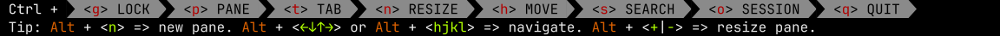

# Zellij Plugin Snapshot

[](https://github.com/fulldecent/zellij-plugin-snapshot/actions/workflows/build-test.yml)
[](https://github.com/fulldecent/zellij-plugin-snapshot/actions/workflows/lint.yml)

A command-line host that loads **your** Zellij plugin `.wasm`, feeds it the same events a real session would, and outputs two files:

| File              | What it is                                                                     |
| ----------------- | ------------------------------------------------------------------------------ |
| `{name}.ansi.txt` | Exact bytes from `render(rows, cols)` (SGR + Zellij UI DCS)                    |
| `{name}.svg`      | That pane painted as self-contained glyph outlines (no font needed to view it) |

Here is the result of driving the [official Zellij wasm plugins for the status bar](https://github.com/zellij-org/zellij/tree/v0.45.1/zellij-utils/assets/plugins) against [a simple test script](examples/scripts/status-bar.yaml). It's SVG, all the colors and glyphs work. Zoom in!



## Installation

You will need rustup, Git and your platform's native build tools.

> [!WARNING]
> rustup is the Rust toolchain manager, which installs rustc and friends at versions we specify in [rust-toolchain.toml](rust-toolchain.toml). We recommend to install rustup using your package manager as this is safer than the advice on the rustup website ([ref](#references)).

If you do not use rustup and instead modify the commands below to use rustc directly, this may use your package manager's (possibly ancient) version. That build may fail and will be unsupported by this project.

```sh
"$(rustup which rustc)" --version
"$(rustup which cargo)" --version
```

Open a terminal (PowerShell on Windows) and use the instructions for your operating system.

### Linux

On Ubuntu 22.04+ or Debian 12+:

```sh
sudo apt update
sudo apt install git build-essential rustup
```

On Fedora:

```sh
sudo dnf install git gcc rustup
```

If your distribution has no `rustup` package, [other rustup installation methods](https://rust-lang.github.io/rustup/installation/other.html) are available, but beware as that page does also recommend some dangerous methods ([ref](#references)).

### macOS

Install Apple's Command Line Tools if they are not already installed:

```sh
xcode-select --install
```

Complete the installation dialog; these tools supply the linker and SDK. With Homebrew installed, install Git and rustup:

```sh
brew install git rustup
```

Homebrew's `rust` formula is a standalone compiler. It does not honor `rust-toolchain.toml`. Use `rustup` instead.

### Windows

Use winget to install Git, the native build tools and rustup:

```powershell
winget install --exact --id Git.Git
winget install --exact --id Microsoft.VisualStudio.2022.BuildTools --override "--wait --passive --norestart --add Microsoft.VisualStudio.Workload.VCTools --includeRecommended"
winget install --exact --id Rustlang.Rustup
```

Allow administrator prompts and wait for installation to finish. The C++ workload supplies the MSVC linker and Windows SDK. Open a new PowerShell window so rustup is on `PATH`.

### Build and install

Clone the project and install the command. From this directory, rustup installs the toolchain in [rust-toolchain.toml](rust-toolchain.toml) on first use. CI uses the same file.

```sh
git clone https://github.com/fulldecent/zellij-plugin-snapshot.git
cd zellij-plugin-snapshot
"$(rustup which rustc)" --version
"$(rustup which cargo)" --version
"$(rustup which cargo)" install --path . --locked
```

In PowerShell:

```powershell
& (rustup which rustc) --version
& (rustup which cargo) --version
& (rustup which cargo) install --path . --locked
```

Cargo installs `zellij-plugin-snapshot` in `$HOME/.cargo/bin` (`%USERPROFILE%\.cargo\bin` on Windows). Add that directory to your PATH if it is not already there.

A published version can also be installed from crates.io:

```sh
"$(rustup which cargo)" install zellij-plugin-snapshot --locked
```

## Usage

A YAML drive script names a plugin wasm, the events to send, and when to call `render`. Paths in `plugin:` that are not absolute are **relative to this YAML file**.

```text
zellij-plugin-snapshot script.yaml [--out DIR]
```

| Argument      | Meaning                                                        |
| ------------- | -------------------------------------------------------------- |
| `script.yaml` | Drive script; relative to the current working directory        |
| `--out DIR`   | Directory for `{name}.ansi.txt` and `{name}.svg` (default `.`) |

`name` is the output stem (`normal.ansi.txt`, `normal.svg`). If omitted, the YAML file stem is used. A `render` step may set its own stem.

### Try the stock Zellij plugins

Download official plugin wasm files, then run the example scripts:

```sh
base="https://raw.githubusercontent.com/zellij-org/zellij/v0.45.1/zellij-utils/assets/plugins"
curl -fsSL -o "examples/plugins/tab-bar.wasm" "$base/tab-bar.wasm"
curl -fsSL -o "examples/plugins/status-bar.wasm" "$base/status-bar.wasm"
curl -fsSL -o "examples/plugins/session-manager.wasm" "$base/session-manager.wasm"

"$(rustup which cargo)" run --locked --quiet -- "examples/scripts/tab-bar.yaml" --out examples/out
"$(rustup which cargo)" run --locked --quiet -- "examples/scripts/status-bar.yaml" --out examples/out
"$(rustup which cargo)" run --locked --quiet -- "examples/scripts/session-manager.yaml" --out examples/out
```

See the resulting images in `examples/out`.

### Snapshot your own plugin

From your plugin crate (the one with `crate-type = ["cdylib"]` and `zellij-tile = "0.45.1"`):

```sh
rustup target add wasm32-wasip1
"$(rustup which cargo)" build --target wasm32-wasip1 --release
```

The artifact is typically `target/wasm32-wasip1/release/<your_crate>.wasm`.

`shots/normal.yaml`:

```yaml
name: normal
plugin: ../target/wasm32-wasip1/release/your_plugin.wasm
geometry:
  rows: 1
  cols: 80
steps:
  - action: grant_permissions
  - action: mode_update
    mode: normal
    session: demo
  - action: tab_update
    tabs:
      - name: Tab
        active: true
        tiled: 1
```

```sh
zellij-plugin-snapshot shots/normal.yaml --out shots
```

A test or CI job is: build wasm, run the host, `diff` the **ANSI** file.

```sh
"$(rustup which cargo)" build --target wasm32-wasip1 --release
zellij-plugin-snapshot shots/normal.yaml --out /tmp/shots
diff -u shots/normal.ansi.txt /tmp/shots/normal.ansi.txt
```

### Script reference

```yaml
name: optional-output-stem
plugin: path/to/plugin.wasm           # relative to this YAML file
config:                               # string map passed to load()
  welcome_screen: "true"
ids:                                  # optional; defaults are 1 / /tmp
  plugin_id: 1
  zellij_pid: 1
  client_id: 1
  initial_cwd: /tmp
world:                                # session list for GetSessionList
  current: demo
  sessions: [demo]
  resurrectable: []
geometry:                             # default render size
  rows: 1
  cols: 80
steps:
  - action: grant_permissions
  - action: initial_keybinds
  - action: mode_update
    mode: normal                      # default normal
    session: demo
  - action: tab_update
    tabs:
      - name: Tab
        active: true
        tiled: 1
        floating: 0
        floating_visible: false
  - action: session_update
    current: demo
    sessions: [demo]
    resurrectable: []
  - action: event_json
    json: '{"ModeUpdate": ...}'       # raw zellij_utils::data::Event
  - action: render                    # render(rows, cols); not an event
    rows: 1                           # optional; falls back to geometry
    cols: 40                          # optional; falls back to geometry
    name: narrow                      # optional when this stem is unique
```

A script with no `render` step sends the events, then calls `render` once with `geometry`. The output stem is `name`, or the YAML file stem when `name` is omitted.

A `render` step calls `render` at that point and writes `{name}.ansi.txt` and `{name}.svg` under `--out`. `rows` and `cols` fall back to `geometry` one field at a time. `name` falls back to the same stem. The host does not render again after the last step. Two renders that would write the same stem fail. A stem is one file name, so `shots/a` and `C:shot` are rejected. `geometry` may be omitted when every `render` step sets both `rows` and `cols`.

A `render` step does not send `TabUpdate`. `viewport_rows`, `viewport_columns`, `display_area_rows`, and `display_area_columns` stay at whatever the last `tab_update` set (40×80 and 42×80 when the script uses the fields above).

`mode_update` always applies a default-session theme (`Styling::from(default_palette())`) and `arrow_fonts: false` (Nerd Font separators), matching a typical local Zellij 0.45 session.

Which steps your plugin needs depends on what it reads in `update`:

| Plugin kind                | Typical steps                                    |
| -------------------------- | ------------------------------------------------ |
| Ignores host (hello-world) | `steps: []`                                      |
| Status / tab bar           | `grant_permissions`, `mode_update`, `tab_update` |
| Stock status-bar           | also `initial_keybinds` (it paints the keymap)   |
| Session / welcome UI       | `world:` plus `session_update`                   |

If `render` is empty or the wasm traps, add the query the plugin makes (`GetSessionList`, permissions, …) via the fields above. Unknown host commands are stubbed so the module can continue.

### Output specification

- **ANSI** (`.ansi.txt`) — the stable source of truth for snapshots. `diff` against this file. Open it in a terminal, or `cat` it. Includes private DCS (`ESC Pz … ESC \`) when the plugin uses Zellij ribbons/tables/text.
- **SVG** — each cell is 5:11 ratio at 16px per row. The image is traced (does not require installed fonts to open it), using JetBrains Mono Nerd Font. Do not snapshot-`diff` SVG.

Theme for DCS expansion is the same default palette as `mode_update`. Unstyled cells sit on a black pane.

This tool captures **one plugin** per run. Each `render` writes that plugin's stdout at that size. It does not load a Zellij layout or compose tab bar, panes, and status bar into one image.

## Development

Thank you for taking an interest in improving Zellij Plugin Snapshot and the plugin READMEs of people using it!

Follow the installation instructions above to get rustup and the native build tools. Work from the project directory. You can run the host without installing it:

```sh
"$(rustup which cargo)" run --locked -- examples/scripts/status-bar.yaml --out examples/out
```

Commit [Cargo.lock](Cargo.lock) so application dependencies remain reproducible.

### Testing

All project updates that we release must conform to our test suite. GitHub Actions runs [checks](.github/workflows) on pushes to `main` and pull requests. You can also run them locally before sending proposed changes:

```sh
"$(rustup which cargo)" test --locked
"$(rustup which cargo)" fmt --all -- --check
"$(rustup which cargo)" clippy --all-targets --locked -- -D warnings
"$(rustup which cargo)" build --release --locked
```

Use `"$(rustup which cargo)" fmt --all` to apply Rust formatting.

With an actively maintained version of Node.js installed, correct other formatting issues before sending proposed changes:

```sh
npx prettier@latest --check . --write
npx markdownlint-cli@latest "**/*.md" --fix
```

Cargo puts build outputs in the ignored `target/` directory. Run the optimized binary with `./target/release/zellij-plugin-snapshot` on Linux/macOS or `.\target\release\zellij-plugin-snapshot.exe` in PowerShell.

### Releases

Use `fix:`, `feat:` or `BREAKING CHANGE:` in your commit messages. This triggers our bot to make a release draft pull request. Merging that pull request triggers a new tag and GitHub Release.

The [release workflow](.github/workflows/release.yml) uses Release Please's `simple` release type. Set the version in [Cargo.toml](Cargo.toml) and [Cargo.lock](Cargo.lock) to the proposed release version before merging the release pull request.

[Build and test](.github/workflows/build-test.yml) builds and tests a release-mode Linux binary, then attests and uploads it. The release includes `zellij-plugin-snapshot` and `release.sigstore.jsonl`, containing build provenance and version attestations. The published binary is for Linux; build from source on macOS or Windows.

The same workflow then publishes the crate to crates.io with Trusted Publishing.

> [!NOTE]
> In your GitHub repository settings, under Actions, General, Workflow permissions, select read and write permissions and check "Allow GitHub Actions to create and approve pull requests". Under General, Releases, enable release immutability. Attestations are available for public repositories; private repositories require GitHub Enterprise Cloud.

### Maintenance

The project administrator completes these maintenance tasks each month. If they are 3+ months late, please remind them or send your own issue/pull request.

1. Identify external Actions in [.github/workflows](.github/workflows) and look for available new versions. Review and update them if it is safe. GitHub-supported Actions (under the actions/ organization) may require only cursory review.
1. Check new Rust releases and whether our minimum supported version or [toolchain](rust-toolchain.toml) should change. Keep the installation instructions and [Cargo.toml](Cargo.toml) consistent with that decision.
1. Review crates in [Cargo.toml](Cargo.toml) and refresh [Cargo.lock](Cargo.lock). `anyhow`, `clap`, `serde`, `serde_json`, `ttf-parser`, and `unicode-width` may take current compatible releases.
1. Keep `zellij-utils` **0.45.1**, `wasmi` / `wasmi_wasi` **1.1.0**, and `prost` **0.12** until Zellij itself ships a newer ABI. Wasmi 2.x is a different interpreter than Zellij 0.45 uses. This snapshot tool will only ever support the latest version of Zellij and `zellij-utils`.
1. `serde_yaml` 0.9 is deprecated. A later swap should be a maintained 0.9-compatible crate such as `serde_yaml_ng`, not `serde_yml`.
1. Review the Zellij tag in the example `curl` commands above when the example wasm files should track a new host.

## Project scope

We want Zellij plugins to be beautiful, present well in their READMEs and have a tight feedback loop from development to testing.

This project creates the best screenshots for Zellij plugins and adopts best practices for integrating this into the plugin development lifecycle. Making the best instructions here and following best practice is in-scope for this project.

Out-of-scope is handling custom color theming that the Zellij host would normally manage from a plugin based on configuration files.

## References

1. We use title case only for proper nouns, including the name of our project.
1. We recommend to use your package manager to install rustup because the rust website prefers the unsafe `curl|sh` method ([issue](https://github.com/rust-lang/rust/issues/163468)).
1. This project is built based on [best practices documented in rust-template](https://github.com/fulldecent/rust-template/), release 1.1.0.
1. The Rust ignore rules in [.gitignore](.gitignore) come from [GitHub's Rust gitignore](https://github.com/github/gitignore/blob/main/Rust.gitignore).
1. This crate is a command-line host. Plugin authors run the binary against their wasm. They do not add it to `[dependencies]` or to `[dev-dependencies]` on stable Cargo (that field links a library, and this package is not one).
1. Publishing from GitHub Actions follows [crates.io Trusted Publishing](https://crates.io/docs/trusted-publishing). The crate's trusted publisher names the workflow file `release.yml` and leaves the environment empty. GitHub's OIDC token is exchanged for a token that lasts about 30 minutes. No crates.io token is stored in this repository.
1. We use an MIT license for this project's source, Copyright (c) 2026 William Entriken. See [LICENSE.md](LICENSE.md). The bundled JetBrains Mono Nerd Font is OFL 1.1 plus Nerd Fonts' terms; see [THIRD_PARTY_NOTICES.md](THIRD_PARTY_NOTICES.md). The published package license is `MIT AND OFL-1.1` because the crate contains both works. In an SPDX expression, `AND` means a recipient complies with both. Cargo documents that field as an SPDX expression: [The `license` and `license-file` fields](https://doc.rust-lang.org/cargo/reference/manifest.html#the-license-and-license-file-fields).
1. Zellij can load a plugin from an HTTPS URL. That is simpler and insecure. We treat that as wrong and do not document it.
